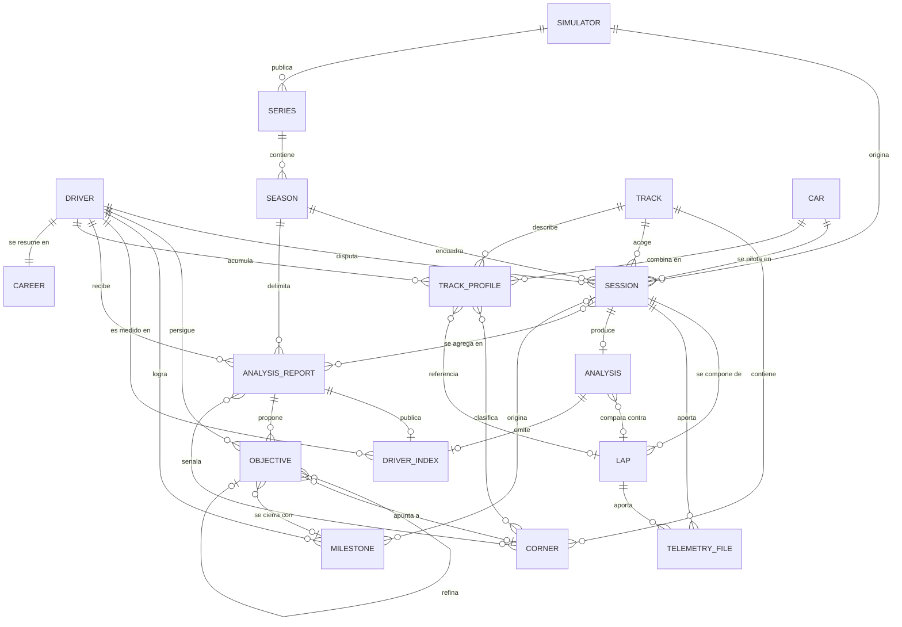
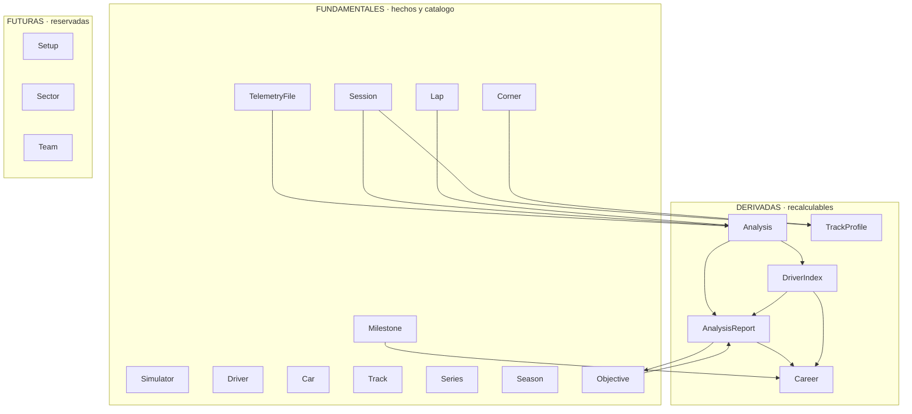

# DDP — Modelo de Datos

**Versión 1.0 · Congelado · Listo para el diseño de SQLite**

> Documento definitivo del dominio de Driver Development Program.
> No contiene SQL, esquema ni código.
>
> Todo atributo procede de la documentación de `version antigua/` y lleva su
> cita. Las únicas adiciones sin respaldo en esa documentación son los cinco
> mecanismos de extensibilidad del apartado 3.6, añadidos para cumplir los
> requisitos de compatibilidad con iRacing y Garage61, y están marcados como
> tales.
>
> Cualquier cambio posterior abre una versión 1.1. El esquema de SQLite debe
> derivarse de este documento, nunca al contrario.

---

# 1. Resumen ejecutivo

## Qué modela DDP

El dominio responde a cinco preguntas, en este orden:

| Pregunta | Entidades que la responden |
|----------|----------------------------|
| ¿Quién pilota, con qué y dónde? | Driver · Car · Track · Corner · Series · Season · Simulator |
| ¿Qué ocurrió en pista? | Session · Lap · TelemetryFile · Milestone |
| ¿Qué dicen los datos? | Analysis · DriverIndex |
| ¿Qué significan y qué hacer? | AnalysisReport · Objective |
| ¿Cómo evoluciono? | TrackProfile · Career |

## Cómo está organizado

El modelo tiene **tres capas** y una regla que las separa:

```
FUNDAMENTALES (12)          Hechos y catálogo. Fuente de verdad.
                            Inmutables una vez registrados.
      │
      │  el Core las procesa
      ▼
DERIVADAS (5)               Resultados de cálculo e interpretación.
                            Borrables y recalculables en cualquier momento.

FUTURAS (3)                 Reservadas. Sin atributos hasta que existan datos.
```

**La regla:** un hecho observado nunca se corrige, porque pasó lo que pasó. Un
derivado siempre puede borrarse y reconstruirse desde los hechos. Si un dato
puede calcularse, no se almacena como hecho.

Esta regla resolvió el problema real que tenía la versión antigua: el iRating
aparecía con tres valores distintos en tres documentos porque se copiaba a mano
en cada uno. En el modelo v1.0 el rating vive en la sesión y todo lo demás lo
deriva.

## El flujo del dominio

```
TelemetryFile ──> Session · Lap ──> Analysis ──> AnalysisReport ──> Objective
   (crudo)          (hechos)       (medición)       (juicio)       (dirección)
                        │                              │
                        └──> TrackProfile · Career <───┘
                              (estado acumulado)
```

Cada etapa consume la anterior. Ninguna salta hacia atrás: la interpretación
nunca realimenta la medición.

## Las cuatro decisiones que dan forma al modelo

**1. La curva, no el sector, es la unidad de trabajo.** Las fuentes nombran
nueve curvas y ninguna medición de sector. `Corner` es entidad fundamental;
`Sector` queda como futura.

**2. El Driver Index es una fotografía, no un atributo del piloto.** Aparece
tres veces con dos conjuntos de dimensiones distintos. Se modela como entidad
propia con dimensiones abiertas, no como columnas fijas.

**3. Informe de sesión, semanal y de carrera son el mismo objeto.** Comparten
estructura completa. Se unifican en `AnalysisReport` con un campo de alcance, lo que
además absorbe el crecimiento a "15-20 páginas por evento" que la versión
antigua declaraba como objetivo.

**4. Nada específico de un simulador se codifica en la estructura.** Los
identificadores externos, las métricas de rating y los atributos propios de
cada plataforma viven en mecanismos genéricos. Añadir un simulador nuevo no
toca ninguna entidad.

## Estado

| Aspecto | Situación |
|---------|-----------|
| Entidades | 20: 12 fundamentales, 5 derivadas, 3 futuras |
| Cobertura de evidencia | Todos los atributos citados a sus fuentes |
| Compatible con iRacing | Verificado en la sección 10 |
| Compatible con Garage61 | Verificado en la sección 11 |
| Multi-simulador | Verificado en la sección 12 |
| Decisiones pendientes | 4, ninguna bloqueante para SQLite (sección 17) |

---

# 2. Clasificación de entidades

## Fundamentales

Hechos observados y catálogo. Son la fuente de verdad: si se pierden, no hay
forma de reconstruirlas.

| # | Entidad | Naturaleza | Evidencia |
|:-:|---------|-----------|-----------|
| 1 | **Simulator** | Catálogo | Observada |
| 2 | **Driver** | Catálogo | Observada |
| 3 | **Car** | Catálogo | Observada |
| 4 | **Track** | Catálogo | Observada |
| 5 | **Corner** | Catálogo | Observada |
| 6 | **Series** | Catálogo | Observada |
| 7 | **Season** | Catálogo | Observada |
| 8 | **Session** | Hecho | Observada |
| 9 | **Lap** | Hecho | Observada |
| 10 | **TelemetryFile** | Hecho | Observada |
| 11 | **Milestone** | Hecho | Observada |
| 12 | **Objective** | Intención autorizada | Observada |

`Objective` es fundamental porque su definición la escribe una persona o un
informe: no se puede recalcular. Su **progreso** sí es derivado y está marcado
como tal dentro de la entidad.

## Derivadas

Producidas por el Core. Borrables y recalculables. Ninguna es fuente de verdad.

| # | Entidad | Producida por | Reconstruible desde |
|:-:|---------|---------------|---------------------|
| 13 | **Analysis** | `telemetry/*` | Session + TelemetryFile |
| 14 | **DriverIndex** | `scoring/driver_score.py` | Analysis + histórico |
| 15 | **AnalysisReport** | `engineer/*` + `reports/*` | Analysis + Objective |
| 16 | **TrackProfile** | `reports/*` | Sessions del combo |
| 17 | **Career** | `reports/career.py` | Todo el histórico |

## Futuras

Reservadas. **Sin atributos definidos.** Se documentan para que su llegada no
obligue a reestructurar nada, pero no se modelan hasta que existan datos reales.

| # | Entidad | Estado | Origen |
|:-:|---------|--------|--------|
| 18 | **Setup** | Ausente en las fuentes | Necesaria para Garage61 |
| 19 | **Sector** | Declarada en el anexo de [W] | Necesaria para Garage61 |
| 20 | **Team** | Ausente en las fuentes | Necesaria para Garage61 |

---

# 3. Principios del modelo

### 3.1 Idioma

Entidades, atributos y módulos en inglés. Documentación, interfaz y textos al
piloto en español. Sin mezclar dentro de un mismo ámbito.

### 3.2 Hechos frente a derivados

Ya enunciado en el resumen. Consecuencia práctica: toda entidad derivada lleva
trazabilidad (`engine_version`, `computed_at`) para poder auditar y recalcular.

### 3.3 Un dato, un lugar

Si un valor puede obtenerse de otra entidad, no se almacena duplicado. Es la
corrección directa del problema del iRating triplicado.

### 3.4 Unidades canónicas

Derivadas de los formatos observados en las fuentes.

| Magnitud | Unidad canónica | Evidencia |
|----------|-----------------|-----------|
| Tiempos de vuelta y sector | entero, milisegundos | Precisión de milisegundo en 2:29.907 [C] |
| Diferencias de tiempo | entero, milisegundos | 0.387 s [I] |
| Distancia en pista | metros | — |
| Velocidad | km/h | — |
| Temperatura | °C | — |
| Fechas | ISO-8601 en UTC | 2026-08-07 [A] |
| Semana | semana ISO del año | "Semana 32" con fecha en semana ISO 32 [S][W][A] |

El entero en milisegundos evita la deriva de coma flotante al sumar sectores o
calcular medias.

### 3.5 Identificadores

Cada entidad tiene identificador técnico opaco (UUID) para las relaciones, y
clave natural para evitar duplicados al importar. La clave natural nunca se usa
como referencia: un circuito no debe romper el modelo al cambiar de nombre.

### 3.6 Los cinco mecanismos de extensibilidad

> **Adición sin respaldo en las fuentes.** Estos cinco mecanismos no proceden de
> `version antigua/`. Se añaden para cumplir los requisitos de compatibilidad
> con iRacing, Garage61 y otros simuladores. Sin ellos el modelo tendría que
> modificarse cada vez que llegara una fuente de datos nueva.

**M1 · `external_ids[]`** — Presente en toda entidad fundamental. Lista de
`{source, external_id}`. Permite que un mismo coche canónico tenga el
identificador de iRacing, el de Garage61 y el de cualquier simulador futuro sin
añadir columnas.

**M2 · `attributes{}`** — Bolsa de pares clave-valor para datos propios de una
fuente que no tienen hueco canónico. El grupo de coches de Garage61 o el nivel
de parrilla de iRacing entran aquí sin tocar la estructura.

**M3 · `raw_payload`** — El registro original tal como llegó, conservado junto a
la entidad. Garantiza que ninguna importación pierda información, incluso la que
hoy no se sabe interpretar.

**M4 · `metrics[]` en Session** — Las puntuaciones de progresión se almacenan
como lista de `{name, value_before, value_after}` en lugar de columnas fijas.
`irating` y `safety_rating` son dos entradas de esa lista, no dos campos. Sin
esto, un simulador con otro sistema de rating obligaría a alterar `Session`.

**M5 · `scope` en TelemetryFile** — La telemetría puede referirse a una sesión
completa o a una sola vuelta. iRacing entrega ficheros por sesión; Garage61
exporta por vuelta. Ambos casos caben.

### 3.7 El modelo no contiene lógica

Las entidades describen datos. Los cálculos viven en el Core. Ninguna entidad
"sabe" calcular su propio índice.

---

# 4. Fuentes de evidencia

| Código | Documento | Aporte principal |
|:------:|-----------|------------------|
| **[P]** | `DDP_00_Perfil_Piloto.md` | Hardware y Driver Index base de nueve dimensiones |
| **[C]** | `DDP_Base_Circuitos.md` | Ficha por combinación: récord, curvas, objetivo |
| **[S]** | `DDP_Semana32_Mount_Panorama.md` | Calificación semanal, objetivos cumplidos, plan |
| **[I]** | `DDP_Informe_001_Mount_Panorama.md` (+ `.pdf`) | Resultado de sesión y evaluación por áreas |
| **[W]** | `DDP_Informe_Semanal_001_..._v2.docx` | Informe semanal completo y alcance futuro declarado |
| **[A]** | `62687942.pdf` | Certificado de iRacing: serie oficial y primera victoria |
| **[M]** | `ChatGPT Image 7 ago 2026, 20_54_39.png` | Mockup del dashboard: vocabulario y formatos de fichero |

**Niveles de evidencia.** *Observado*: hay datos reales. *Declarado*: las
fuentes lo anuncian como futuro sin datos. *Ausente*: no se menciona.

[M] es un mockup: sus cifras son ilustrativas, pero su vocabulario y los
elementos que muestra son evidencia de qué se espera almacenar.

---

# 5. Hallazgos del dominio

Doce observaciones extraídas de las fuentes, cada una con su consecuencia sobre
el modelo. Son la justificación de por qué el modelo tiene esta forma.

| # | Hallazgo | Consecuencia |
|:-:|----------|--------------|
| 1 | Las fuentes nombran nueve curvas y ninguna medición de sector; los sectores solo aparecen como intención futura | `Corner` fundamental, `Sector` futura |
| 2 | El Driver Index usa nueve dimensiones en [P] y seis en [I]; [M] muestra solo el global | Dimensiones abiertas, no columnas fijas |
| 3 | El global es la media exacta en [P] (89,33 → 89,3) pero no en [I] (media 90,67, publicado 90,8) | El global se almacena tal como se emitió; no se recalcula |
| 4 | Los objetivos se refinan en cadena: "Bajar de 2:30" → "…de forma consistente" → "2:29.2-2:29.4" | `Objective.supersedes_id` |
| 5 | Existen seis naturalezas de objetivo: umbral, rango, mantenimiento, categórico, logro y proceso | `Objective.nature` + ventana de evaluación |
| 6 | En [I] cuatro áreas llevan nota y "Gestión del coche" no | La nota es opcional; el área es texto libre |
| 7 | El anexo de [W] declara sectores, neumáticos, combustible y pilotos de referencia | Alcance futuro, no ausencia |
| 8 | [W] escribe "Semana 32 - Temporada 3 2026"; [A] fecha 2026-08-07, semana ISO 32 | Semana ISO y temporada del simulador son ejes independientes |
| 9 | [I] cita el hardware al evaluar: "el freno duro de las ClubSport V3" | El hardware es contexto de análisis, no adorno |
| 10 | El iRating aparece como 1392 (+79) en [I] y 1362→1480 (+118) en [W], marcado "aproximado" | El rating vive en la sesión; todo lo demás lo deriva |
| 11 | Tres nombres para el circuito y dos para una curva | `aliases[]` en Track, Corner y Car |
| 12 | [M] navega con Temporada, Circuitos e Ingeniero IA | "Circuitos" confirma `TrackProfile` como entidad propia |

---

# 6. Auditoría del modelo

Resultado de la revisión completa. Se documentan los defectos encontrados en la
versión anterior y qué se hizo con cada uno, para que el cambio sea auditable.

## 6.1 Entidades duplicadas

| Hallazgo | Resolución |
|----------|------------|
| `EngineerReport` y `WeeklyReport` compartían quince atributos con nombres distintos: resumen, análisis del ingeniero, fortalezas, aspectos a mejorar, objetivos, comentario final y número de secuencia | **Unificadas en `AnalysisReport`** con campo `scope` ∈ {session, weekly, career}. El informe de carrera, que `reports/career.py` iba a producir, queda cubierto sin una cuarta entidad |
| El Driver Index estaba en tres sitios: `Driver.driver_index`, `EngineerReport.driver_index` y `Career.index_history` | **Extraído a `DriverIndex`**, entidad derivada de tipo fotografía. Las tres apariciones pasan a ser consultas sobre la misma entidad |
| `Career` y `TrackProfile` eran el mismo concepto a dos escalas: estado acumulado derivado | Se mantienen separadas por semántica distinta (hitos frente a clasificación de curvas), pero se agrupan explícitamente como *estado acumulado* para que se implementen igual |
| `Milestone` y `Objective` describían el mismo hecho: "Ganar una carrera → Completado" [M] y "First Win" [A] | Se mantienen separadas con papeles claros: `Milestone` es hecho externo certificado, `Objective` es intención interna. La relación se declara en una sola dirección |

## 6.2 Relaciones redundantes

Cinco relaciones eran derivables de otras y se han eliminado.

| Relación eliminada | Motivo |
|--------------------|--------|
| `Series → Session` | Transitiva vía `Session → Season → Series` |
| `AnalysisReport → Analysis` | Transitiva vía `AnalysisReport → Session → Analysis` |
| `Career → Season` | Derivable: la carrera abarca todas las temporadas del piloto |
| `Career → Milestone` | Redundante con `Driver → Milestone`, siendo `Career` 1:1 con `Driver` |
| `TrackProfile → Objective` | Redundante con el ámbito de circuito y coche que ya lleva `Objective` |

## 6.3 Nombres inconsistentes

| Antes | Ahora |
|-------|-------|
| `improvement_points` · `improvement_areas` · `improvement_areas_ranked` (cuatro nombres para lo mismo, en tres entidades) | `assessments[]` con `kind` ∈ {strength, improvement} y `rank` |
| `executive_summary` · `engineer_analysis` · `engineer_comment` · `final_observation` · `ui_highlight` (cinco campos narrativos sin criterio) | `sections[]` con `key` y `body`, abierto y ordenable |
| `best_lap_time` · `best_lap` · `lap_time` | `*_time_ms` de forma uniforme |
| `sequence_number` reutilizado en tres entidades para tres series distintas | `session_number`, `report_number` |
| `global_index_current` · `global_value` · "Nivel IA" | `DriverIndex.global_value`, con las etiquetas de interfaz fuera del modelo |
| `Car.name_upper` | Absorbido en `aliases[]` |
| `nature` en Objective y en DriverIndex con significados distintos | `Objective.nature` y `DriverIndex.kind` |
| `Report`, ambiguo frente a futuras exportaciones y otros tipos de informe | `AnalysisReport`, con clave ajena `source_analysis_report_id` |

## 6.4 Atributos ubicados en la entidad equivocada

Trece correcciones.

| Atributo | Estaba en | Debe estar en | Motivo |
|----------|-----------|---------------|--------|
| `irating_current`, `safety_rating_current` | Driver | Derivado de `Session.metrics[]` | Causa directa del hallazgo 10 |
| `global_index_current` | Driver | `DriverIndex` más reciente | Es una fotografía fechada |
| `strengths`, `improvement_areas` | Driver | `Career` (consolidado) y `AnalysisReport` (por periodo) | Proceden de informes, no del piloto |
| `driver_index` | Driver | `DriverIndex` | Ídem |
| `current_car_id`, `current_season_label` | Driver | Fuera del modelo | Estado de interfaz, no dominio |
| `background_note` | Driver y Career | `Career` | Estaba duplicado |
| `splits[]` | Series | `Session.split` | El split es de la sesión concreta |
| `next_race` | Season | Derivado de `Season.schedule` | Es la próxima entrada por fecha |
| `pace_evolution` | Analysis | `Career.pace_history` | Serie multisesión en una entidad de sesión única |
| `reference_policy` | Analysis | Fuera del modelo | Es una regla del proyecto, ya recogida en `DDP_RULES.md` |
| `is_personal_best_combo` | Lap | `TrackProfile.best_lap_id` | Cambia con el tiempo; no es propiedad de la vuelta |
| `highlighted_results[]` | Ambos informes | Derivado de las sesiones cubiertas | Duplicaba el resultado de la sesión |
| `ingest_method`, `import_action` | TelemetryFile | Fuera del modelo | Eran textos de interfaz del mockup |
| `best_lap`, `track_id`, `car_id` | WeeklyReport | Derivados de las sesiones cubiertas | Redundantes |

## 6.5 Dependencias circulares

Tres ciclos detectados y roto cada uno dejando una sola dirección.

| Ciclo | Resolución |
|-------|------------|
| `AnalysisReport → Objective` (los proponía) y `Objective → AnalysisReport` (origen) | Solo `Objective.source_analysis_report_id`. Los objetivos de un informe pasan a ser una consulta |
| `Objective → Milestone` (cerrado por) y `Milestone → Objective` | Solo `Objective.closed_by_milestone_id`. `Milestone` queda como hecho puro sin punteros |
| `Session.best_lap_id → Lap` y `Lap.session_id → Session` | `Session` conserva `best_lap_time_ms` (dato observado) pero no la clave ajena. La vuelta se identifica por `Lap.is_session_best` |

`Objective.supersedes_id` es autorreferencia, no ciclo, pero debe mantenerse
acíclica: un objetivo no puede refinarse a sí mismo ni formar un bucle.

## 6.6 Conceptos simplificados

| Simplificación | Efecto |
|----------------|--------|
| Dos entidades de informe → una con `scope` | −1 entidad, −15 atributos duplicados |
| Cinco campos narrativos → `sections[]` | Estructura abierta que absorbe el crecimiento a 15-20 páginas declarado en [W] |
| Fortalezas y mejoras en cuatro sitios → `assessments[]` | Una sola forma reutilizada por `AnalysisReport` y `Career` |
| Ratings como columnas fijas → `metrics[]` | Habilita cualquier simulador sin tocar `Session` |
| Identificadores por plataforma → `external_ids[]` | Habilita iRacing, Garage61 y futuros sin tocar entidades |
| Objetivos y hitos como texto en informes → relaciones | Elimina texto duplicado y hace el progreso calculable |

## 6.7 Resumen del cambio

| Métrica | v0 | v1.0 |
|---------|:--:|:----:|
| Entidades | 18 | 20 |
| Entidades duplicadas | 2 | 0 |
| Relaciones redundantes | 5 | 0 |
| Ciclos | 3 | 0 |
| Atributos mal ubicados | 13 | 0 |
| Nombres inconsistentes | 7 grupos | 0 |
| Compatible con otro simulador | No | Sí |

Las dos entidades nuevas netas son `Simulator` y `DriverIndex`, más `Team` como
futura, menos la fusión de los dos informes.

---

# 7. Entidades fundamentales

Las doce entidades fundamentales llevan siempre, además de sus atributos
propios, los tres mecanismos genéricos: `external_ids[]` (M1), `attributes{}`
(M2) y `raw_payload` (M3). No se repiten en cada tabla.

---

## 7.1 Simulator

**Responsabilidad.** El simulador de origen de los datos. Existe para que
ninguna entidad tenga que codificar en su estructura las particularidades de una
plataforma concreta.

| Atributo | Dato observado | Fuente |
|----------|----------------|--------|
| `name` | "iRacing" | [P][A][W] |
| `rating_metrics[]` | Nombres de las métricas de progresión que expone: "irating", "safety_rating" | [I][W][M] |
| `telemetry_formats[]` | `.ibt` · `.csv` · `.rpy` | [M] |
| `incident_notation` | Sufijo `x`: "0x", "13x" | [W][M] |

`rating_metrics[]` declara qué métricas tiene sentido esperar en las sesiones de
ese simulador. Es lo que permite a `Session.metrics[]` ser genérico sin perder
significado.

**Relaciones.** `Session` 1→N · `Series` 1→N.
**Identificador.** Técnico `simulator_id`; natural `name`.
**Core.** Contexto en `telemetry/parser.py` para elegir estrategia de lectura.

---

## 7.2 Driver

**Responsabilidad.** El piloto: identidad y hardware. Solo contiene lo que es
estable y propio de la persona. Todo lo que varía con el tiempo (rating, índice,
fortalezas) vive en las entidades que lo miden.

| Atributo | Dato observado | Fuente |
|----------|----------------|--------|
| `full_name` | "David Patiño Queiruga" | [P][W][A] |
| `display_name` | "David" | [M] |
| `kind` | `self` · `external` | Requisito de Garage61 (sección 11) |
| `level_badge` | "Elite Regional" | [M] |
| `development_statement` | "Desarrollarse como piloto completo de iRacing mediante análisis de telemetría, ritmo, consistencia y racecraft" | [P] |
| `long_term_aim` | "construir un piloto completo: rápido, constante, limpio y capaz de rendir cada semana en cualquier circuito del calendario" | [W] |
| `hardware` | Estructura, ver abajo | [P] |

### Hardware

| Campo | Dato observado |
|-------|----------------|
| `wheel` | Thrustmaster T300RS |
| `pedals` | Fanatec ClubSport V3 |
| `pedal_mods` | Brake Performance Kit · Damper Kit en acelerador |
| `connection_note` | Conexión USB independiente |

Este detalle es necesario porque [I] lo cita al evaluar la frenada: *"Muy buen
uso del freno duro de las ClubSport V3"*.

`kind` distingue al piloto propio de los pilotos externos cuyas vueltas se usan
como referencia. Es el mecanismo que permite almacenar datos de terceros sin
entidades nuevas.

**Relaciones.** `Session` 1→N · `Objective` 1→N · `Milestone` 1→N ·
`DriverIndex` 1→N · `AnalysisReport` 1→N · `TrackProfile` 1→N · `Career` 1→1.
**Identificador.** Técnico `driver_id`; natural `external_ids[]` por simulador.
**Core.** `engineer/*`, `scoring/`, `objectives/`, `reports/*`.

**Derivado, no almacenado:** iRating y Safety Rating actuales (última
`Session.metrics[]`), índice actual (`DriverIndex` más reciente), fortalezas y
debilidades (`Career`).

---

## 7.3 Car

**Responsabilidad.** El coche. En las fuentes es solo una etiqueta, pero forma
con el circuito la unidad de comparación de tiempos.

| Atributo | Dato observado | Fuente |
|----------|----------------|--------|
| `name` | "Toyota GR86" | [C][S][I][W] |
| `short_name` | "GR86" | [M] |
| `aliases[]` | "TOYOTA GR86" | [A] |

**Relaciones.** `Session` 1→N · `TrackProfile` 1→N · `Milestone` 1→N.
**Identificador.** Técnico `car_id`; natural `name` canónico.
**Core.** Contexto de comparación en `telemetry/analyzer.py` y `scoring/`.

**Ausente en las fuentes.** Ningún dato técnico: masa, potencia, tracción,
ayudas, categoría, depósito. Cuando lleguen de una plataforma entrarán por
`attributes{}` (M2) sin alterar la entidad.

---

## 7.4 Track

**Responsabilidad.** El circuito. Aporta el contexto del análisis y agrupa las
curvas con nombre propio que el ingeniero usa para explicarse.

| Atributo | Dato observado | Fuente |
|----------|----------------|--------|
| `name` | "Mount Panorama" · "Oulton Park" | [C][S][I][W] · [M] |
| `aliases[]` | "Bathurst" · "MOUNT PANORAMA CIRCUIT" | [I] · [A] |
| `zones[]` | "la subida" | [I] |
| `map_asset` | Silueta del trazado | [M] |

`zones[]` recoge tramos que abarcan varias curvas: [I] habla de *"pequeñas
pérdidas en la subida"*.

**Relaciones.** `Corner` 1→N · `Session` 1→N · `TrackProfile` 1→N ·
`Milestone` 1→N.
**Identificador.** Técnico `track_id`; natural `name` canónico + `aliases[]`.
**Core.** `telemetry/parser.py`, `telemetry/analyzer.py`, `engineer/coach.py`.

**Ausente.** Longitud, país, sectores, desnivel, variantes de trazado.

---

## 7.5 Corner

**Responsabilidad.** Una curva con nombre propio. Es la unidad real de trabajo
del piloto: los objetivos y las áreas de mejora se expresan como curvas.

| Atributo | Dato observado | Fuente |
|----------|----------------|--------|
| `name` | Griffin's Bend, Reid Park, McPhillamy, Murray's, The Cutting, Forrest's Elbow, The Chase, Skyline | [C][S][W][M] |
| `aliases[]` | "Forest Elbow" | [W][M] |
| `category` | "curvas lentas" | [I] |
| `phase_focus` | "The Chase (salida)" | [C] |

La clasificación en curva fuerte o a mejorar **no** vive aquí: depende del
piloto y del coche, y por tanto pertenece a `TrackProfile`. La curva en sí es un
hecho del circuito.

**Relaciones.** `Track` N→1 · `TrackProfile` N↔M · `Objective` 1→N ·
`AnalysisReport` N↔M.
**Identificador.** Técnico `corner_id`; natural `(track_id, name)`.
**Core.** `telemetry/analyzer.py`, `engineer/coach.py`,
`engineer/recommendations.py`.

**Ausente.** Numeración, distancia, dirección, apex, punto de frenada. Las
fuentes nombran las curvas pero nunca las miden.

---

## 7.6 Series

**Responsabilidad.** La competición. Determina el nivel de oposición y el marco
en el que un resultado significa algo.

| Atributo | Dato observado | Fuente |
|----------|----------------|--------|
| `name` | "iRacing Sports Car Series" | [A] |
| `is_official` | "Carrera oficial" | [I] |

**Relaciones.** `Simulator` N→1 · `Season` 1→N · `Milestone` 1→N.
**Identificador.** Técnico `series_id`; natural `(simulator_id, name)`.
**Core.** `scoring/`, `objectives/`, `reports/career.py`.

**Ausente.** Licencia, categoría, setup fijo, multiclase, número de splits.

---

## 7.7 Season

**Responsabilidad.** El marco temporal. Las fuentes trabajan con dos ejes
simultáneos: la temporada del simulador y la semana ISO del calendario.

| Atributo | Dato observado | Fuente |
|----------|----------------|--------|
| `year` | 2026 | [I][W][A] |
| `season_number` | 3, de "Temporada 3 2026" | [W] |
| `schedule[]` | Calendario semanal, ver abajo | [I][W][M] |

### Entrada de `schedule[]`

| Campo | Dato observado | Fuente |
|-------|----------------|--------|
| `iso_week` | 32 | [S][W] |
| `track_id` | Mount Panorama · Oulton Park | [I][W] · [M] |
| `car_id` | Toyota GR86 · GR86 | [I][W] · [M] |
| `starts_on` | "27 May 2026" | [M] |

La tarjeta "Próxima carrera" de [M] es la primera entrada futura de
`schedule[]` ordenada por fecha, no un campo aparte.

**Relaciones.** `Series` N→1 · `Session` 1→N · `AnalysisReport` 1→N.
**Identificador.** Técnico `season_id`; natural `(series_id, year, season_number)`.
**Core.** `reports/weekly.py`, `reports/career.py`, `objectives/`.

**Ausente.** Fechas de inicio y fin de temporada, calendario completo.

---

## 7.8 Session

**Responsabilidad.** Una salida a pista con resultado. Es la entidad central:
todo informe parte de una o varias sesiones, y todo dato de progresión se
registra aquí.

### Contexto

| Atributo | Dato observado | Fuente |
|----------|----------------|--------|
| `session_number` | "Informe de Sesión 001" | [I] |
| `simulator_id` | iRacing | [P][A][W] |
| `driver_id` | David Patiño Queiruga | [P][W][A] |
| `track_id` / `car_id` | Mount Panorama · Toyota GR86 | [I][W][M] |
| `season_id` | Temporada 3 2026 | [I][W] |
| `iso_week` | 32 | [W] |
| `session_type` | "Carrera oficial" · "Carrera 1" · "Carrera 2" · clasificación | [I][W] |
| `split` | "Split 3" | [M] |
| `started_at` | "24 May 2026 · 20:15" | [M] |

La existencia de clasificación se deduce de dos datos de [W]: *"saliendo desde
la Pole Position"* y *"Buscar vueltas de clasificación por debajo de 2:30"*.

### Resultado

| Atributo | Dato observado | Fuente |
|----------|----------------|--------|
| `start_position` | "saliendo P2" · "desde la Pole Position" | [W] |
| `finish_position` | "2º" · "P2" · "P1" · "10º" · "15º" | [I][W][M] |
| `lap_count` | 6 | [I] |
| `best_lap_time_ms` | 2:31.063 · 2:30.540 | [I] · [W] |
| `average_lap_time_ms` | 2:32.341 | [I] |
| `gap_to_winner_ms` | 0.387 s | [I] |
| `incidents` | 0 · 13 · 11, notación `x` | [W][M] |
| `yellow_flags` | 0 | [I] |
| `flags[]` | "Pole" · "Fast Lap" | [M] |

`incidents` y `yellow_flags` son datos distintos: [I] los reporta por separado.

### Métricas de progresión (M4)

Lista `metrics[]` de entradas `{name, value_before, value_after}`:

| `name` | Dato observado | Fuente |
|--------|----------------|--------|
| `irating` | 1362 → 1480 · 1392 (+79) | [W] · [I] |
| `safety_rating` | 2.58 → 2.99 · 2.76 (+0.21) | [W] · [I] |

El delta no se almacena: es la diferencia entre los dos valores. Esta lista es
**la única fuente de verdad del rating** en todo el modelo.

**Relaciones.** `Simulator` N→1 · `Driver` N→1 · `Track` N→1 · `Car` N→1 ·
`Season` N→1 · `Lap` 1→N · `TelemetryFile` 1→N · `Analysis` 1→0..1 ·
`AnalysisReport` N↔M · `Milestone` 1→0..N.
**Identificador.** Técnico `session_id`; natural `external_ids[]` (la
subsesión del simulador) o `(driver_id, started_at)`.
**Core.** Todos los módulos.

**Ausente.** Duración, condiciones de pista, meteorología, nivel de parrilla,
paradas. Ninguna fuente contiene un solo dato de condiciones. Cuando lleguen,
entrarán por `attributes{}` (M2).

---

## 7.9 Lap

**Responsabilidad.** Una vuelta. Es la unidad en la que piloto e ingeniero
razonan: todas las cifras de rendimiento de las fuentes son tiempos por vuelta.

| Atributo | Dato observado | Fuente |
|----------|----------------|--------|
| `lap_number` | Deducido de "Vueltas: 6" | [I] |
| `lap_time_ms` | 2:29.907 · 2:31.063 · 2:30.540 | [C][S] · [I] · [W] |
| `context` | carrera · clasificación | [W] |
| `is_session_best` | Distintivo "Fast Lap" | [M] |
| `is_valid` | Implícito en el cómputo de vueltas | [I] |

### Descripciones cualitativas que el modelo debe poder reproducir

Las fuentes describen la distribución sin enumerar las vueltas, lo que indica
qué se espera calcular a partir de esta entidad:

| Descripción | Fuente |
|-------------|--------|
| "Las vueltas estuvieron agrupadas alrededor del 2:31 bajo, sin caídas importantes" | [I] |
| "varias vueltas consecutivas dentro de pocas décimas" | [W] |
| "Evolución desde vueltas de 2:32 hasta un ritmo constante de 2:30" | [W] |

**Relaciones.** `Session` N→1 · `TelemetryFile` 1→0..N (M5) ·
`Analysis` 0..N→1 (como vuelta de referencia).
**Identificador.** Técnico `lap_id`; natural `(session_id, lap_number)`.
**Core.** `telemetry/analyzer.py`, `telemetry/consistency.py`.

**Ausente.** Tanda, combustible, desgaste, velocidades, parciales, errores por
vuelta. Ninguna fuente contiene una tabla de vueltas individuales.

---

## 7.10 TelemetryFile

**Responsabilidad.** El registro crudo y su puerta de entrada al sistema. Es la
fuente de verdad última: todo derivado puede recalcularse desde aquí.

Guarda metadatos y una referencia al fichero, **nunca las muestras**. Un fichero
contiene cientos de miles de muestras por canal.

| Atributo | Dato observado | Fuente |
|----------|----------------|--------|
| `scope` | `session` · `lap` (M5) | Requisito de Garage61 |
| `session_id` / `lap_id` | Según el alcance | [M] |
| `format` | `.ibt` · `.csv` · `.rpy` | [M] |
| `storage_path` | Ruta del fichero importado | [M] |
| `content_hash` | Huella para evitar importar dos veces | Requisito de integridad |
| `channels[]` | Ver abajo | [I][W][S] |

### Canales referidos en el análisis

Las fuentes no listan canales, pero el ingeniero razona sobre magnitudes
concretas, lo que evidencia cuáles se leían:

| Magnitud | Texto de origen | Fuente |
|----------|-----------------|--------|
| Presión de freno | "el freno duro", "sin bloqueos importantes", "liberación del freno bastante limpia" | [I] |
| Acelerador | "Muy progresivo", "abrir gas antes y con mayor decisión" | [I][W] |
| Ángulo de volante | "menos correcciones de volante", "sin aumentar el ángulo de volante" | [W][S] |
| Tracción de salida | "una mejor tracción a la salida de curva" | [W] |

**Relaciones.** `Session` N→1 o `Lap` N→1, según `scope`.
**Identificador.** Técnico `telemetry_file_id`; natural `content_hash`.
**Core.** `telemetry/parser.py` **en exclusiva**. Ningún otro módulo abre el
fichero: todos consumen la salida normalizada del parser. Es la frontera que
mantiene aislada la lógica de formatos.

**Ausente.** Frecuencia de muestreo, número de muestras, versión de formato.

---

## 7.11 Milestone

**Responsabilidad.** Un logro puntual y verificable. Se distingue de `Objective`
en que no tiene progreso: ocurrió, y queda fechado. Es un hecho, no un derivado.

| Atributo | Dato observado | Fuente |
|----------|----------------|--------|
| `title` | "First Individual iRacing Sports Car Series Victory" | [A] |
| `short_title` | "First Win" | [A] |
| `driver_id` | David Patiño Queiruga | [A] |
| `car_id` / `track_id` / `series_id` | TOYOTA GR86 · MOUNT PANORAMA CIRCUIT · iRacing Sports Car Series | [A] |
| `session_id` | La carrera ganada | [W] |
| `achieved_on` | 2026-08-07 | [A] |
| `issuer` | iRacing, firmado por John Henry y David Kaemmer | [A] |
| `document_type` | "Certificate of Achievement" | [A] |
| `certificate_file` | `62687942.pdf` | [A] |

El mismo hecho aparece en tres fuentes con tres papeles distintos: objetivo
cumplido en [M], resultado de sesión en [W] y hito certificado en [A]. El modelo
lo registra una sola vez aquí, y `Objective` apunta a él.

**Relaciones.** `Driver` N→1 · `Session` N→0..1 · `Series`/`Car`/`Track` N→1.
**Identificador.** Técnico `milestone_id`; natural `(driver_id, title)`.
**Core.** `reports/career.py`, `objectives/objectives.py`.

**Sin punteros de salida hacia `Objective`:** la relación se declara solo desde
`Objective`, para no reintroducir el ciclo del apartado 6.5.

---

## 7.12 Objective

**Responsabilidad.** Hacia dónde va el piloto y cuánto le falta. Es fundamental
porque su definición se escribe: no puede recalcularse. Su progreso sí es
derivado y está marcado como tal.

### Definición (fundamental)

| Atributo | Dato observado | Fuente |
|----------|----------------|--------|
| `title` | "Superar 1600 de iRating", "Mantener carreras a 0x", "Competir regularmente por victorias", "Entrar en Split 2", "Ganar una carrera" | [W][M] |
| `nature` | umbral · rango · mantenimiento · categórico · logro · proceso | [S][C][W][M] |
| `target_metric` | irating · lap_time · incidents · split | [C][W][M] |
| `target_value` | 1600 · 2:30 | [W] · [S] |
| `target_range` | "2:29.2 - 2:29.4" | [C] |
| `target_qualifier` | "de forma consistente" | [C][I] |
| `evaluation_window` | "las últimas 2 carreras" | [M] |
| `scope_track_id` / `scope_car_id` | Objetivo dentro de la ficha de un combo | [C] |
| `priority_order` | Objetivos numerados 1 a 4 | [W] |
| `source_analysis_report_id` | Objetivo propuesto en un informe | [I][W] |
| `supersedes_id` | Cadena de refinamiento, ver abajo | [S][I][C] |

`target_qualifier` y `evaluation_window` recogen una distinción esencial del
dominio: "bajar de 2:30" y "bajar de 2:30 de forma consistente" no son el mismo
objetivo, y una vuelta suelta no valida el segundo.

### Cadenas de refinamiento observadas

```
"Bajar de 2:30"  ->  "Bajar de 2:30 de forma consistente"
                 ->  "Rodar de forma consistente en 2:29.2 - 2:29.4"

"Superar 1600 de iRating"  ->  "Llegar a 1600 iRating · 1480/1600 · 75%"
```

### Progreso (derivado)

Recalculable tras cada sesión; nunca se edita a mano.

| Atributo | Dato observado | Fuente |
|----------|----------------|--------|
| `status` | activo · completado · cumplido | [M][S] |
| `progress_pct` | 100 · 100 · 60 · 75 | [M] |
| `current_value` | "1480 / 1600" · "Actualmente en Split 3" | [M] |
| `closed_by_milestone_id` | "Ganar una carrera" cerrado por "First Win" | [M][A] |
| `evaluated_at` | — | — |

### Objetivos de proceso

Tres de los objetivos observados no se miden en pista: *"Analizar telemetría"*,
*"Crear perfil inicial del piloto"* [S] y *"Continuar el análisis semanal
mediante telemetría"* [W]. El modelo debe admitirlos con `nature = proceso` y
progreso manual.

**Relaciones.** `Driver` N→1 · `Corner` N→0..1 · `AnalysisReport` N→0..1 (origen) ·
`Milestone` N→0..1 (cierre) · `Objective` N→0..1 (refinamiento).

La revisión de objetivos en el informe semanal —los *"Objetivos cumplidos"* de
[S]— **no se almacena**: se deriva consultando qué objetivos cambiaron de estado
dentro del periodo que cubre el informe.
**Identificador.** Técnico `objective_id`; sin clave natural estable, porque los
enunciados se repiten refinados entre periodos.
**Core.** `objectives/objectives.py` como propietario; `engineer/*` y
`reports/*` como consumidores.

**Ausente.** Fecha de alta, plazo, hitos intermedios, fórmula del porcentaje.

---

# 8. Entidades derivadas

Las cinco entidades derivadas llevan siempre trazabilidad: `engine_version`,
`computed_at` e `inputs_hash`. No se repite en cada tabla.

Ninguna es fuente de verdad. Todas pueden borrarse y reconstruirse.

---

## 8.1 Analysis

**Responsabilidad.** El resultado objetivo del análisis de **una** sesión. Mide,
no opina. Es la frontera entre medir e interpretar.

| Atributo | Dato observado | Fuente |
|----------|----------------|--------|
| `session_id` | Sesión analizada | [M] |
| `status` | "Análisis completo" | [M] |
| `reference_lap_id` | La vuelta contra la que se compara | [S] |
| `reference_source` | propia · ideal · externa | [S] |
| `theoretical_best_ms` | Vuelta ideal por mejores tramos | Declarado |
| `consistency_metrics` | "varias vueltas consecutivas dentro de pocas décimas" | [W] |
| `time_loss_by_corner[]` | "pequeñas pérdidas acumuladas en las salidas de curva" | [S] |
| `estimated_gains[]` | "0.2–0.3 s mediante mejor rotación en curvas lentas" · "algunas centésimas en Skyline y Forest Elbow" | [I] · [W] |
| `driver_inputs_summary` | Freno, acelerador, volante | [I][W] |
| `errors_detected[]` | "Sin bloqueos importantes" | [I] |

`time_loss_by_corner[]` es el resultado de mayor valor: convierte una diferencia
abstracta de tiempo en un mapa de dónde está. La nota del ingeniero de [S] lo
enuncia con precisión: *"El tiempo no se pierde en una única curva"*.

**Relaciones.** `Session` 1→1 · `Lap` N→0..1 (referencia) ·
`DriverIndex` 1→0..1.
**Identificador.** Técnico `analysis_id`; natural `(session_id, engine_version)`.
**Core.** Producida por `telemetry/analyzer.py`, `consistency.py`, `fuel.py` y
`tires.py`. Consumida por `engineer/*`, `scoring/`, `reports/*` y `objectives/`.

**Trasladado fuera:** `pace_evolution` (serie multisesión) ahora vive en
`Career.pace_history`; `reference_policy` es una regla de proyecto y está en
`DDP_RULES.md`.

---

## 8.2 DriverIndex

**Responsabilidad.** Una fotografía fechada de las capacidades del piloto. Se
extrajo como entidad propia porque en la versión antigua el mismo indicador
estaba en tres lugares con dos esquemas distintos de dimensiones.

| Atributo | Dato observado | Fuente |
|----------|----------------|--------|
| `driver_id` | El piloto medido | [P][I] |
| `kind` | "Base" · "estimado" | [P] · [I] |
| `computed_for` | Perfil general · sesión concreta | [P] · [I] |
| `dimensions[]` | Pares nombre-valor, ver abajo | [P][I] |
| `global_value` | 89.3 · 90.8 · 92 | [P] · [I] · [M] |
| `error_score` | "Driver Error Score: 95/100" | [I] |

### Dimensiones observadas

Conjunto **abierto**: cada fotografía declara las dimensiones que mide
(hallazgo 2).

| Dimensión | [P] | [I] |
|-----------|:---:|:---:|
| Ritmo | — | 91 |
| Consistencia | 96 | 93 |
| Control del coche | 92 | — |
| Frenada | 89 | 89 |
| Trail Braking | 81 | — |
| Rotación | 80 | — |
| Aplicación del gas / Acelerador | 93 | 92 |
| Gestión de neumáticos | 95 | 91 |
| Adaptación | 90 | — |
| Racecraft | 88 | 88 |

Cada entrada de `dimensions[]` lleva `name`, `value` e `is_estimated`, porque [P]
marca *"Racecraft (estimado)"* frente al resto.

`global_value` **se almacena tal como se emitió** y no se recalcula: en [P]
coincide con la media (89,33 → 89,3) pero en [I] no (media 90,67, publicado
90,8). La fórmula de agregación es la decisión pendiente 1.

**Relaciones.** `Driver` N→1 · `Analysis` N→0..1 · `AnalysisReport` N→0..1.
**Identificador.** Técnico `driver_index_id`; natural
`(driver_id, computed_at, kind)`.
**Core.** `scoring/driver_score.py` como propietario; `reports/*` y
`engineer/coach.py` como consumidores.

---

## 8.3 AnalysisReport

**Responsabilidad.** La interpretación: qué significan los datos y qué hacer.
Es la entidad mejor documentada de las fuentes y el corazón del producto.

**Unifica** los antiguos `EngineerReport` y `WeeklyReport`, que compartían quince
atributos, y cubre además el informe de carrera que `reports/career.py` produce.

**Por qué este nombre.** Es un informe de análisis: nace de una o varias
sesiones analizadas y emite juicio sobre ellas. El nombre lleva el prefijo
`Analysis` para no colisionar con futuros documentos que también serían
"informes" pero no pertenecen a esta cadena: exportaciones a PDF, resúmenes
compartibles, fichas de comparación o informes generados para terceros. Si
alguno de ellos llega, será una entidad distinta y no habrá ambigüedad de
nombre.

| Atributo | Dato observado | Fuente |
|----------|----------------|--------|
| `scope` | `session` · `weekly` · `career` | [I] · [S][W] · Declarado |
| `report_number` | "Informe de Sesión 001" · "Informe Semanal 001" | [I] · [W] |
| `driver_id` | "Piloto: David Patiño Queiruga" | [W] |
| `period_label` | "Semana 32 - Temporada 3 2026" | [W] |
| `title_combo` | "Mount Panorama (Toyota GR86)" | [W] |
| `overall_grade` | "Calificación: 8.9 / 10" | [S] |
| `focus_next` | "Próximo objetivo: Forest Elbow" | [M] |
| `status` | "Análisis completo" | [M] |
| `sections[]` | Narrativa, ver abajo | [I][W][M] |
| `assessments[]` | Fortalezas y mejoras, ver abajo | [P][S][I][W] |
| `area_evaluations[]` | Evaluación por área, ver abajo | [I] |
| `recommendations[]` | Plan de entrenamiento, ver abajo | [S] |
| `driver_index_id` | Índice emitido con el informe | [I] |

### `sections[]` — narrativa abierta

Sustituye a los cinco campos de texto inconsistentes de la versión anterior.
Cada entrada tiene `key`, `title`, `body` y `order`.

| `key` observada | Texto de origen | Fuente |
|-----------------|-----------------|--------|
| `executive_summary` | "Regreso a iRacing tras varios años. Evolución desde vueltas de 2:32 hasta un ritmo constante de 2:30…" | [W] |
| `engineer_analysis` | "La mejora principal no proviene de frenar más tarde, sino de abrir gas antes y con mayor decisión…" | [W] |
| `engineer_comment` | "Esta sesión confirma que ya no estamos trabajando para aprender el coche…" | [I] |
| `final_observation` | "El objetivo ya no es únicamente ser más rápido…" | [W] |
| `engineer_notes` | "El tiempo no se pierde en una única curva…" | [S] |
| `highlight` | "Excelente evolución esta semana. La mayor mejora ha venido de la salida de curva." | [M] |

Ser abierta es lo que permite absorber el crecimiento declarado en el anexo de
[W] hasta *"un informe profesional de 15-20 páginas por evento"* sin añadir
columnas.

### `assessments[]` — fortalezas y áreas de mejora

Una sola forma para lo que antes tenía cuatro nombres en tres entidades. Campos:
`kind` ∈ {strength, improvement}, `text`, `rank`, `subject_type` ∈ {corner,
technique}, `corner_id`.

| Ejemplo | `kind` | `subject_type` | Fuente |
|---------|--------|----------------|--------|
| "Consistencia sobresaliente" | strength | technique | [S] |
| "Muy pocos errores" | strength | technique | [I] |
| "Excelente gestión del riesgo (0 incidentes)" | strength | technique | [W] |
| "The Cutting" (rango 1) | improvement | corner | [S] |
| "Transición freno → acelerador" (rango 3) | improvement | technique | [S] |
| "Seguir refinando las frenadas en The Chase" | improvement | corner | [W] |

`subject_type` es necesario porque [S] mezcla curvas y técnicas en la misma lista
numerada.

### `area_evaluations[]` — evaluación por áreas

| Campo | Dato observado | Fuente |
|-------|----------------|--------|
| `area_name` | Ritmo, Consistencia, Frenada, Acelerador, Gestión del coche | [I] |
| `assessment_text` | Texto libre, en ocasiones con viñetas | [I] |
| `score_out_of_10` | 9 · 9 · 8.8 · 9.2 · **ausente en "Gestión del coche"** | [I] |
| `source_note` | "Según la telemetría revisada en sesiones anteriores" | [I] |

La nota es **opcional** (hallazgo 6) y el área es texto libre, no un enum
cerrado. `source_note` registra que una evaluación puede apoyarse en sesiones
anteriores.

### `recommendations[]` — plan de entrenamiento

| Campo | Dato observado | Fuente |
|-------|----------------|--------|
| `action` | "Trabajar rotación del coche", "Abrir gas antes sin aumentar el ángulo de volante", "Comparar siempre con una vuelta de referencia" | [S] |
| `target_corner_id` | Curva donde practicar | [W][M] |
| `success_criterion` | — | Declarado |
| `status` | propuesta · en curso · cumplida | Declarado |

**Relaciones.** `Driver` N→1 · `Session` N↔M (sesiones cubiertas) ·
`Season` N→0..1 · `Corner` N↔M · `Objective` 1→N (consulta por
`source_analysis_report_id`) · `DriverIndex` 1→0..1.
**Identificador.** Técnico `analysis_report_id`; natural `(scope, report_number)`.
**Core.** Producido por `engineer/coach.py`, `engineer/recommendations.py`,
`reports/session.py`, `reports/weekly.py` y `reports/career.py`.

**Derivado, no almacenado:** mejor vuelta del periodo, circuito y coche
dominantes, resultados destacados. Todo se obtiene de las sesiones cubiertas.

---

## 8.4 TrackProfile

**Responsabilidad.** El conocimiento acumulado sobre una combinación de piloto,
circuito y coche: la referencia personal, qué curvas se dominan, qué curvas
fallan y cuál es el objetivo vigente ahí.

Es la memoria del piloto por combinación. Corresponde al documento *"Base de
Datos de Circuitos"* [C] y a la sección "Circuitos" del mockup [M]. Se distingue
de `AnalysisReport` en que no describe un periodo cerrado sino un estado vigente que se
actualiza.

| Atributo | Dato observado | Fuente |
|----------|----------------|--------|
| `driver_id` | El piloto | [C] |
| `track_id` / `car_id` | Mount Panorama · Toyota GR86 | [C] |
| `best_lap_id` | "Mejor tiempo: 2:29.907" | [C] |
| `corner_assessments[]` | Curvas fuertes y a mejorar, ver abajo | [C] |
| `active_objective_id` | "Rodar de forma consistente en 2:29.2 - 2:29.4" | [C] |

### `corner_assessments[]`

| `assessment` | Curvas observadas | Fuente |
|--------------|-------------------|--------|
| `strong` | Griffin's Bend, Reid Park, McPhillamy, Murray's | [C] |
| `weak` | The Cutting, Forrest's Elbow, The Chase (salida) | [C] |

Esta clasificación vive aquí y no en `Corner` porque depende del piloto y del
coche: la misma curva puede ser fuerte con un coche y débil con otro.

**Relaciones.** `Driver` N→1 · `Track` N→1 · `Car` N→1 · `Corner` N↔M ·
`Lap` N→0..1 (mejor vuelta).
**Identificador.** Técnico `track_profile_id`; natural
`(driver_id, track_id, car_id)`.

> La clave natural de la versión anterior era `(track_id, car_id)`, sin el
> piloto. Corregido en la auditoría: el perfil es conocimiento **de un piloto**
> sobre un combo.

**Core.** `engineer/coach.py` para contextualizar con lo ya sabido del combo;
`reports/career.py` para la progresión por circuito; `objectives/` para el
objetivo vigente.

**Ausente.** Fecha del récord, número de sesiones en el circuito, histórico de
mejores tiempos.

---

## 8.5 Career

**Responsabilidad.** La perspectiva de largo plazo. Trabaja con tendencias, no
con eventos: una mala sesión no mueve la aguja, un patrón de tres meses sí.

[W] enuncia su propósito: *"construir un piloto completo… capaz de rendir cada
semana en cualquier circuito del calendario de iRacing"*, y añade que el informe
inicial *"será la base sobre la que crecerá toda la temporada"*.

| Atributo | Dato observado | Fuente |
|----------|----------------|--------|
| `driver_id` | Relación 1 a 1 | [P][W] |
| `background_note` | "Regreso a iRacing tras varios años" | [W] |
| `pace_history` | Mejor vuelta de las últimas 10 sesiones, 2:28.0 – 2:32.0 | [M] |
| `pace_progression` | "Evolución desde vueltas de 2:32 hasta un ritmo constante de 2:30" | [W] |
| `metric_history[]` | irating 1362 → 1392 → 1480 · safety_rating 2.58 → 2.76 → 2.99 | [I][W][M] |
| `index_history` | 89.3 → 90.8 → 92 | [P][I][M] |
| `consolidated_strengths[]` | "Muy consistente", "Excelente gestión del acelerador", "Gran cuidado de neumáticos", "Conducción limpia" | [P] |
| `persistent_weaknesses[]` | "Rotación del coche", "Trail Braking", "Salida de curva" | [P] |
| `totals` | Sesiones, vueltas, circuitos | Declarado |

`consolidated_strengths[]` y `persistent_weaknesses[]` proceden de [P] y estaban
almacenados en `Driver`. La auditoría los movió aquí: no son propiedades de la
persona sino conclusiones acumuladas que cambian con el tiempo.

Las tres series históricas son reconstruibles a partir de las sesiones, lo que
confirma que `Career` es una vista materializada y no una fuente de verdad. Si
se borra, se reconstruye.

**Relaciones.** `Driver` 1→1. Los hitos y las temporadas se obtienen a través de
`Driver`, sin relación almacenada (apartado 6.2).
**Identificador.** Técnico `career_id`; natural `driver_id`.
**Core.** `reports/career.py` como propietario; `scoring/` aporta el histórico de
índice; `objectives/` la proyección.

**Ausente.** Progresión por categoría de coche, detección de estancamiento,
resumen por temporada, volumen de práctica en horas.

---

# 9. Entidades futuras

Reservadas sin atributos. Se documentan para que su llegada no obligue a
reestructurar nada.

## 9.1 Setup

**Estado:** ausente en las siete fuentes.

Ninguna menciona configuración del coche: ni presiones, ni alineación, ni
suspensión, ni reparto de frenada, ni diferencial, ni aerodinámica, ni
relaciones de cambio. Tampoco se alude a haber cambiado el setup entre sesiones.
El único indicio indirecto es que [I] atribuye la falta de rotación a la técnica
del piloto y no al coche, lo que sugiere que el setup no se consideraba variable.

**Por qué se reserva.** Garage61 sincroniza y comparte setups (sección 11). Sin
esta entidad, esos datos no tendrían dónde alojarse.

**Relaciones previstas.** `Session` 1→N · `Car` N→1 · `Track` N→1 ·
`Setup` N→1 (linaje).

## 9.2 Sector

**Estado:** declarada en el anexo de [W] como *"análisis por sectores"*. Sin
datos.

Las fuentes localizan el rendimiento por **curva con nombre**, no por sector
(hallazgo 1). El sector es una intención de futuro, no una necesidad actual.

**Por qué se reserva.** Garage61 compara *"sector by sector"* y el informe
declarado en [W] lo incluye.

**Relaciones previstas.** `Lap` N→1 · `Track` N→1 (definición del tramo).

## 9.3 Team

**Estado:** ausente en las siete fuentes.

**Por qué se reserva.** Garage61 organiza el acceso a datos por equipos: la API
solo expone vueltas y setups del usuario y de sus compañeros. Sin `Team` no se
puede representar de quién procede una vuelta de referencia ni por qué es
accesible.

**Relaciones previstas.** `Driver` N↔M · `Setup` 1→N · `Lap` (visibilidad).

---

# 10. Compatibilidad con iRacing

Comprobación de que todo dato que iRacing expone tiene destino en el modelo sin
alterar ninguna entidad.

| Dato de iRacing | Destino en el modelo | Mecanismo |
|-----------------|----------------------|-----------|
| Identificador de subsesión | `Session.external_ids[]` | M1 |
| Identificador de cliente | `Driver.external_ids[]` | M1 |
| Identificadores de coche y circuito | `Car.external_ids[]` · `Track.external_ids[]` | M1 |
| Tipo de sesión | `Session.session_type` | Directo |
| Serie, temporada y semana | `Series` · `Season` · `Season.schedule[]` | Directo |
| Resultado y posiciones | `Session.start_position` · `finish_position` | Directo |
| Diferencia con el ganador | `Session.gap_to_winner_ms` | Directo |
| Incidencias | `Session.incidents` | Directo |
| Banderas amarillas | `Session.yellow_flags` | Directo |
| iRating antes y después | `Session.metrics[]` con `name = irating` | M4 |
| Safety Rating antes y después | `Session.metrics[]` con `name = safety_rating` | M4 |
| Pole y vuelta rápida | `Session.flags[]` | Directo |
| Split | `Session.split` | Directo |
| Tiempos por vuelta | `Lap.lap_time_ms` | Directo |
| Validez de vuelta | `Lap.is_valid` | Directo |
| Tiempos por sector | `Sector` | Entidad futura 9.2 |
| Telemetría `.ibt` | `TelemetryFile` con `scope = session` | M5 |
| Setup `.sto` | `Setup` | Entidad futura 9.1 |
| Licencia y división | `Driver.attributes{}` | M2 |
| Nivel y tamaño de parrilla | `Session.attributes{}` | M2 |
| Condiciones y meteorología | `Session.attributes{}` | M2 |
| Certificados de logro | `Milestone` | Directo |
| Registro original completo | `raw_payload` | M3 |

**Resultado:** todo cabe. Tres datos requieren entidades futuras ya reservadas
(`Sector`, `Setup`) y cuatro entran por `attributes{}` porque no hay evidencia en
las fuentes que justifique darles un hueco canónico todavía.

---

# 11. Compatibilidad con Garage61

Garage61 es una plataforma de telemetría compartida para iRacing con más de 50
millones de vueltas. Su valor está en comparar contra vueltas de otros pilotos,
y su API expone datos que la versión anterior del modelo **no** podía alojar.

## 11.1 Mapeo de datos

| Dato de Garage61 | Destino en el modelo | Mecanismo |
|------------------|----------------------|-----------|
| `platforms` | `Simulator` | Directo |
| `cars` · `tracks` | `Car` · `Track` con `external_ids[]` | M1 |
| `car_groups` | `Car.attributes{}` | M2 |
| `me` · cuentas vinculadas | `Driver` con `kind = self` | Directo |
| Pilotos y compañeros de equipo | `Driver` con `kind = external` | Directo |
| `teams` y sus estadísticas | `Team` | Entidad futura 9.3 |
| `laps`: vueltas propias | `Lap` de una `Session` propia | Directo |
| `laps`: vueltas de terceros | `Lap` de una `Session` de un `Driver` externo | Directo |
| Récords de vuelta | `TrackProfile.best_lap_id` · consulta sobre `Lap` | Directo |
| Marca de mejor vuelta personal | `Lap.is_session_best` · `TrackProfile` | Directo |
| `lap_csv`: telemetría por vuelta | `TelemetryFile` con `scope = lap` | **M5** |
| Comparación sector a sector | `Sector` | Entidad futura 9.2 |
| Setups sincronizados | `Setup` | Entidad futura 9.1 |
| Estadísticas de combustible | `Analysis.attributes{}` hasta que exista `fuel_model` | M2 |
| Estadísticas de neumáticos | `Analysis.attributes{}` hasta que exista `tire_model` | M2 |
| Vueltas fantasma | `Lap` externa + `TelemetryFile` de alcance vuelta | M5 |
| Notas de análisis | `AnalysisReport.sections[]` · `Analysis.attributes{}` | M2 |
| Resultados de planes de entrenamiento | `Objective` + `AnalysisReport.recommendations[]` | Directo |
| Clasificaciones y leaderboards | Derivado: consulta sobre `Lap` | Ninguno |

## 11.2 Los dos hallazgos que obligaron a cambiar el modelo

**La telemetría de Garage61 es por vuelta, no por sesión.** iRacing entrega un
`.ibt` por sesión; Garage61 exporta un CSV por vuelta. El modelo anterior ataba
`TelemetryFile` a `Session` en exclusiva, así que la exportación de Garage61 no
tenía dónde alojarse. Resuelto con **M5**: `TelemetryFile.scope` admite `session`
o `lap`.

**Las vueltas de referencia son de otros pilotos.** El anexo de [W] ya lo
anticipaba al declarar *"comparación con pilotos de referencia"*. En lugar de
crear entidades nuevas para pilotos externos, sus vueltas se almacenan como
`Lap` de una `Session` cuyo `Driver` tiene `kind = external`. Toda la maquinaria
de análisis y comparación funciona igual sobre ellas.

## 11.3 Restricción que el modelo debe respetar

La API de Garage61 solo expone datos visibles para el usuario autenticado y sus
compañeros de equipo, y está sujeta a las preferencias de privacidad de cada
piloto. El modelo registra el origen de cada dato en `external_ids[]` y su
pertenencia en `Team`, de modo que sea posible saber qué se puede volver a
consultar y qué no.

**Resultado:** todo cabe. Un dato exigió el mecanismo M5 y tres apuntan a
entidades futuras ya reservadas.

---

# 12. Extensibilidad multi-simulador

Comprobación de que añadir un simulador no rompe la estructura.

## 12.1 Qué habría roto el modelo sin los mecanismos

| Riesgo | Por qué rompía | Cómo se evita |
|--------|----------------|---------------|
| Cada simulador tiene su sistema de progresión | `irating_before` como columna fija no significa nada en otro simulador | M4: `metrics[]` con nombre |
| Cada simulador usa sus identificadores | Un campo `platform_car_id` solo sirve para uno | M1: `external_ids[]` por fuente |
| Cada simulador tiene su formato de telemetría | Un enum cerrado de formatos bloquea la entrada | `Simulator.telemetry_formats[]` |
| Cada simulador cuenta las incidencias a su manera | La notación `x` es de iRacing | `Simulator.incident_notation` |
| No todos organizan la temporada en semanas | Un `iso_week` obligatorio excluye simuladores sin rotación semanal | `Season` y `iso_week` opcionales en `Session` |
| Los tipos de sesión varían | Un enum cerrado excluye tipos ajenos | Vocabulario abierto en `session_type` |
| Los coches y circuitos son los mismos en varios simuladores | Duplicar el catálogo por plataforma fragmenta el histórico | `Car` y `Track` canónicos, plataforma en `external_ids[]` |

El último punto es el más valioso a largo plazo: el mismo Mount Panorama en dos
simuladores es **un** `Track` con dos identificadores externos. Eso permite
comparar el progreso del piloto en el circuito por encima de la plataforma.

## 12.2 Prueba de esfuerzo

Ejercicio: incorporar Assetto Corsa Competizione, que no tiene iRating ni
rotación semanal de contenido y usa otro formato de telemetría.

| Paso | Cambio necesario |
|------|------------------|
| Registrar el simulador | Una entrada en `Simulator` con sus formatos y métricas |
| Coches y circuitos | Enlazar `external_ids[]` a los canónicos existentes o crear nuevos |
| Sesiones sin temporada | `season_id` e `iso_week` quedan vacíos |
| Sesiones sin rating | `metrics[]` vacío o con las métricas propias del simulador |
| Telemetría | Nuevo valor en `Simulator.telemetry_formats[]` |
| **Entidades modificadas** | **Ninguna** |
| **Atributos añadidos** | **Ninguno** |

**Resultado:** el modelo soporta simuladores adicionales sin cambios
estructurales. El coste de incorporar uno nuevo es de datos, no de esquema.

---

# 13. Diagramas

## 13.1 Relaciones entre entidades

Solo relaciones almacenadas. Las cinco relaciones redundantes eliminadas en la
auditoría no aparecen, y las derivables se obtienen por consulta.



Las tres entidades futuras no aparecen porque aún no tienen atributos. Sus
relaciones previstas están en la sección 9.

## 13.2 Capas y flujo



La flecha de `AnalysisReport` a `Objective` y de vuelta representa dos relaciones
distintas: el informe propone objetivos nuevos, y los objetivos vigentes
condicionan el siguiente informe. No es un ciclo de dependencia estructural:
solo se almacena `Objective.source_analysis_report_id`.

---

# 14. Vocabulario del dominio

Términos tomados literalmente de las fuentes. Son los que deben usarse en
código, interfaz e informes. Las unidades canónicas están en el apartado 3.4.

| Término | Significado | Fuente |
|---------|-------------|--------|
| Driver Index | Puntuación multidimensional del piloto | [P][I] |
| Driver Error Score | Indicador de limpieza, separado del índice | [I] |
| Nivel IA | Etiqueta del índice global en interfaz | [M] |
| Ingeniero IA | Nombre de la capa de interpretación | [M] |
| Vuelta de referencia | Vuelta contra la que se compara siempre | [S] |
| Ritmo | Velocidad base del piloto | [I][W] |
| Ritmo constante | Tiempo repetible, no la mejor vuelta | [W] |
| Consistencia | Vueltas agrupadas sin caídas de rendimiento | [I][W] |
| Trail Braking | Dimensión del índice | [P] |
| Rotación | Capacidad del coche de girar | [P][I][S] |
| Aplicación del gas | Dimensión del índice, "Acelerador" en [I] | [P][I] |
| Salida de curva | Fase donde se concentra la pérdida de tiempo | [P][S][W][M] |
| Transición freno → acelerador | Área de mejora técnica | [S] |
| Liberación del freno | Fase final de la frenada | [I] |
| Correcciones de volante | Indicador de limpieza | [W] |
| Gestión de neumáticos | Dimensión del índice | [P][I] |
| Racecraft | Dimensión del índice | [P][I] |
| Adaptación | Dimensión del índice | [P] |
| Gestión del riesgo | Evitar incidencias | [W] |
| Curva fuerte / a mejorar | Clasificación de curva por combinación | [C] |
| Curvas lentas | Categoría de curva | [I] |
| La subida | Zona del circuito | [I] |
| Stint | Tanda de vueltas | [I] |
| Split | Nivel de parrilla | [M] |
| Pole / Fast Lap | Distintivos de sesión | [M] |
| 0x | Carrera sin incidencias | [W][M] |
| Carrera oficial | Tipo de sesión que puntúa | [I] |
| Objetivos cumplidos | Objetivos cerrados del periodo | [S] |
| Plan de entrenamiento | Acciones para el siguiente periodo | [S] |
| Notas del ingeniero | Valoración de contexto | [S][I][W] |
| Combinación circuito + coche | Unidad de comparación de tiempos | [C][I][W] |

---

# 15. Inconsistencias de las fuentes

El modelo las resuelve en lugar de heredarlas.

| # | Inconsistencia | Fuentes | Cómo la resuelve el modelo |
|:-:|----------------|---------|----------------------------|
| 1 | Nueve dimensiones del índice frente a seis | [P] vs [I] | `DriverIndex.dimensions[]` abierto |
| 2 | Índice global no reproducible como media | [I] | Se almacena tal como se emitió |
| 3 | iRating discrepante entre documentos | [I] vs [W] | Única fuente: `Session.metrics[]` |
| 4 | "Forrest's Elbow" y "Forest Elbow" | [C] vs [W][M] | `Corner.aliases[]` |
| 5 | Tres nombres para Mount Panorama | [C][I][A] | `Track.aliases[]` |
| 6 | Récord del combo mejor que la sesión documentada | [C] vs [I] | `TrackProfile` abarca varias sesiones |
| 7 | Tres etiquetas para el mismo indicador | [P][I][M] | Un solo `DriverIndex.global_value` |
| 8 | Un área evaluada sin nota | [I] | `score_out_of_10` opcional |
| 9 | Fechas del mockup anteriores al certificado | [M] vs [A] | [M] se trata como ilustrativo |
| 10 | Navegación del mockup distinta del frontend | [M] | Decisión pendiente 4 |

---

# 16. Ausencias

Lo que ninguna fuente menciona y por tanto no se modela con atributos propios.
Cuando llegue, entrará por `attributes{}` o por las entidades futuras.

| Ámbito | Detalle | Destino previsto |
|--------|---------|------------------|
| Setup del coche | Presiones, alineación, suspensión, reparto de frenada, diferencial, aerodinámica, cambio | Entidad futura 9.1 |
| Sectores | Tiempos y límites por tramo | Entidad futura 9.2 |
| Equipos | Pertenencia y visibilidad de datos | Entidad futura 9.3 |
| Condiciones | Temperatura, estado de goma, lluvia, viento, hora del simulador | `Session.attributes{}` |
| Datos técnicos del coche | Masa, potencia, tracción, ayudas, categoría, depósito | `Car.attributes{}` |
| Geometría del circuito | Longitud, desnivel, distancias, apex, puntos de frenada | `Track.attributes{}` · `Corner.attributes{}` |
| Registro vuelta a vuelta | Ninguna fuente contiene una tabla de vueltas | `Lap`, ya preparada |
| Metadatos de telemetría | Frecuencia de muestreo, número de muestras, canales | `TelemetryFile.attributes{}` |
| Estrategia | Paradas, combustible cargado, ventanas | `Analysis.attributes{}` |
| Volumen de práctica | Horas y vueltas acumuladas | `Career.totals` |

---

# 17. Decisiones pendientes

Ninguna bloquea el diseño de SQLite: las cuatro afectan a cálculo o a
presentación, no a la estructura de las entidades.

### 1. Fórmula del índice global

En [P] el global es la media exacta de las dimensiones; en [I] no. El modelo
almacena el valor emitido, así que puede avanzar sin resolverlo, pero
`scoring/driver_score.py` necesitará una regla antes de implementarse:
media simple, media ponderada, o el valor que emita el motor de coaching.

### 2. Conjunto canónico de dimensiones

Cuatro dimensiones son comunes a [P] y [I]: Consistencia, Frenada, Racecraft y
Gestión de neumáticos. "Aplicación del gas" y "Acelerador" parecen la misma. Hay
que decidir si se normalizan los nombres al importar o se conservan tal como los
emitió cada informe.

### 3. Relación entre Driver Index y Driver Error Score

[I] los publica como dos indicadores separados (90.8/100 y 95/100). Queda por
decidir si el Error Score es una dimensión más, un indicador independiente o un
componente del global.

### 4. Vocabulario de navegación

El mockup [M] usa Dashboard, Temporada, Circuitos, Sesiones, Telemetría,
Ingeniero IA y Ajustes. El frontend actual usa Dashboard, Sesiones, Telemetría,
Piloto, Informes y Configuración. Afecta a la interfaz, no al modelo, pero
conviene alinearlo: "Circuitos" corresponde a `TrackProfile` y "Temporada" a
`Season`.

---

# 18. Apéndice · Extracción literal de las fuentes

Datos tal como aparecen, para poder verificar cualquier atributo del modelo.

## [P] Perfil del piloto

Piloto: David Patiño Queiruga · Volante: Thrustmaster T300RS · Pedalera:
Fanatec ClubSport V3 · Brake Performance Kit · Damper Kit en acelerador ·
Conexión USB independiente.

Driver Index (Base): Consistencia 96 · Control del coche 92 · Frenada 89 ·
Trail Braking 81 · Rotación 80 · Aplicación del gas 93 · Gestión de neumáticos
95 · Adaptación 90 · Racecraft (estimado) 88 · **Global 89.3/100**.

Fortalezas: muy consistente · excelente gestión del acelerador · gran cuidado de
neumáticos · conducción limpia. Áreas de mejora: rotación del coche · trail
braking · salida de curva.

## [C] Base de circuitos

Mount Panorama · Mejor tiempo 2:29.907 · Coche Toyota GR86 · Curvas fuertes:
Griffin's Bend, Reid Park, McPhillamy, Murray's · Curvas a mejorar: The Cutting,
Forrest's Elbow, The Chase (salida) · Próximo objetivo: rodar de forma
consistente en 2:29.2 - 2:29.4.

## [S] Semana 32

Circuito Mount Panorama · Coche Toyota GR86 · Mejor vuelta 2:29.907 ·
Calificación 8.9/10 · Objetivos cumplidos: bajar de 2:30, analizar telemetría,
crear perfil inicial del piloto · Fortalezas: consistencia sobresaliente,
frenadas estables, excelente gestión de neumáticos · Áreas de mejora: 1. The
Cutting, 2. Forrest's Elbow, 3. Transición freno → acelerador · Plan de
entrenamiento: trabajar rotación del coche, abrir gas antes sin aumentar el
ángulo de volante, comparar siempre con una vuelta de referencia · Notas del
ingeniero: "El tiempo no se pierde en una única curva. La diferencia con una
vuelta de 2:28 proviene de pequeñas pérdidas acumuladas en las salidas de
curva."

## [I] Informe de sesión 001

Temporada 2026 · Semana: Mount Panorama – Toyota GR86 · Sesión: carrera oficial
(última disputada) · Posición 2º · iRating 1392 (+79) · Safety Rating 2.76
(+0.21) · Vueltas 6 · Mejor vuelta 2:31.063 · Media 2:32.341 · Diferencia con el
ganador 0.387 s · Amarillas 0.

Evaluación: Ritmo 9/10 · Consistencia 9/10 · Frenada 8.8/10 · Acelerador 9.2/10
· Gestión del coche (sin nota).

Driver Index (estimado): Ritmo 91 · Consistencia 93 · Frenada 89 · Acelerador 92
· Racecraft 88 · Gestión neumáticos 91 · **Global 90.8/100** · Driver Error
Score 95/100.

Próximos objetivos: bajar de 2:30 de forma consistente · ganar 0.2–0.3 s
mediante mejor rotación en curvas lentas · adelantar la aplicación del
acelerador en las dos salidas críticas · seguir reduciendo pequeñas pérdidas en
la subida.

## [W] Informe semanal 001

Semana 32 - Temporada 3 2026 · Carrera 1: P2 saliendo P2, 0x · Carrera 2:
victoria desde la Pole Position, 0x · Vuelta rápida en carrera 2:30.540 · Ritmo
medio alrededor de 2:31 · iRating 1362 → 1480 (+118) · Safety Rating 2.58 → 2.99.

Aspectos a mejorar: seguir refinando las frenadas en The Chase · ganar algunas
centésimas en Skyline y Forest Elbow · buscar vueltas de clasificación por
debajo de 2:30 de forma consistente.

Objetivos: 1. superar 1600 de iRating · 2. mantener carreras a 0x · 3. competir
regularmente por victorias · 4. continuar el análisis semanal mediante
telemetría.

Anexo declarado: comparativas de telemetría · análisis por sectores · gráficos
de evolución · comparación con pilotos de referencia · desgaste de neumáticos ·
consumo de combustible · recomendaciones para el siguiente circuito · formato de
15-20 páginas por evento.

## [A] Certificado

Certificate of Achievement · First Individual iRacing Sports Car Series Victory
· First Win · TOYOTA GR86 · MOUNT PANORAMA CIRCUIT · 2026-08-07 · David Patiño
Queiruga · firmado por John Henry y David Kaemmer.

## [M] Mockup del dashboard

Navegación: Dashboard · Temporada · Circuitos · Sesiones · Telemetría ·
Ingeniero IA · Ajustes.

Indicadores: iRating 1480 (+118) · Safety Rating 2.99 (+0.23) · Nivel IA 92/100
(Excelente) · Próxima carrera: Oulton Park, GR86, 27 May 2026.

Evolución del rendimiento: últimas 10 sesiones, eje de 2:28.0 a 2:32.0, sesiones
S1 a S10.

Ingeniero IA: "Excelente evolución esta semana. La mayor mejora ha venido de la
salida de curva." · Próximo objetivo: Forest Elbow · Estado: análisis completo.

Objetivos actuales: mantener 0x (0x en las últimas 2 carreras, 100%) · ganar una
carrera (completado, 100%) · entrar en Split 2 (actualmente en Split 3, 60%) ·
llegar a 1600 iRating (1480/1600, 75%).

Últimas sesiones: P1 Mount Panorama 24 May 2026 20:15 (Pole, Fast Lap, 0x, +88
iR) · P2 Mount Panorama 17 May 2026 19:48 (0x, +30 iR) · 10º Mount Panorama 10
May 2026 20:05 (13x, −12 iR) · 15º Mount Panorama 03 May 2026 18:55 (11x, −25
iR).

Importación: "Arrastra y suelta tus archivos .ibt, .csv o .rpy aquí".

Piloto: David Patiño · Elite Regional · Toyota GR86 · 2026 Season.

---

# 19. Cierre de la versión 1.0

## Qué queda cerrado

| Elemento | Estado |
|----------|--------|
| Entidades y clasificación | Cerrado: 12 fundamentales, 5 derivadas, 3 futuras |
| Atributos y sus fuentes | Cerrado: todos citados |
| Relaciones | Cerrado: sin redundancias ni ciclos |
| Nombres | Cerrado: unificados |
| Unidades canónicas | Cerrado |
| Vocabulario del dominio | Cerrado |
| Compatibilidad iRacing y Garage61 | Verificada |
| Extensibilidad multi-simulador | Verificada |

## Qué no cierra este documento

Las cuatro decisiones de la sección 17, que afectan a cálculo y presentación. El
diseño de SQLite puede avanzar sin ellas.

## Reglas de uso

1. El esquema de SQLite se deriva de este documento, nunca al contrario.
2. Cualquier atributo nuevo debe añadirse con su justificación citada, igual que
   se ha hecho aquí con cada uno.
3. Un dato que puede calcularse no se almacena como hecho.
4. Un dato específico de una plataforma entra por `external_ids[]`,
   `attributes{}` o `raw_payload`, nunca como atributo nuevo de una entidad.
5. Modificar entidades, relaciones o clasificación abre una versión 1.1 con su
   propia auditoría.

**Versión 1.0 · congelada · lista para el diseño de SQLite.**


